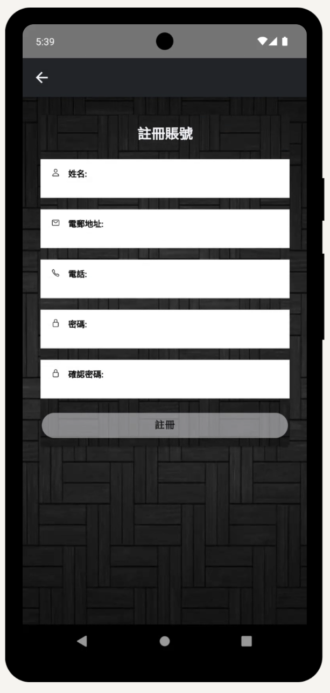
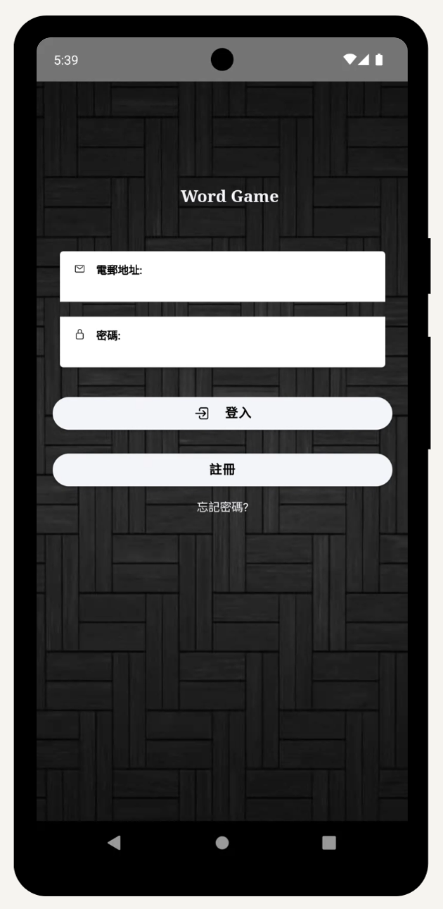
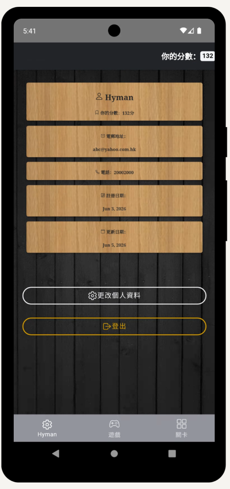
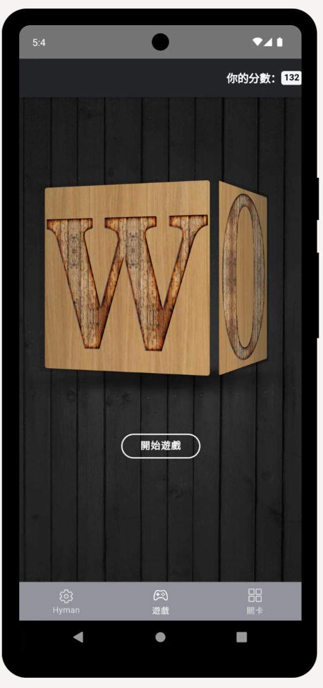
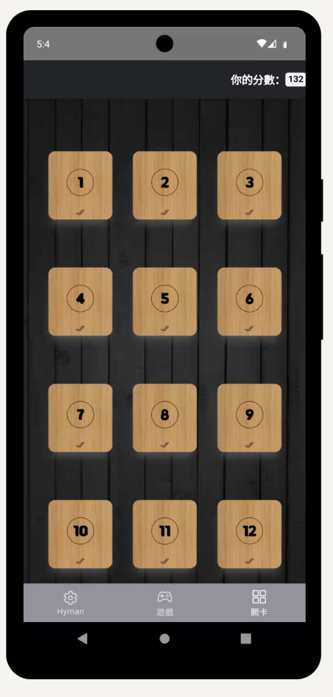
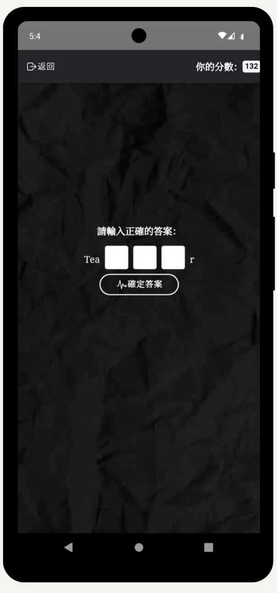

# 🎮 Word Game 

An engaging word puzzle app built with Ionic Framework for Android and iOS. Word Game features a 3D user experience where players solve exactly 20 word questions. Supported by secure account sync, players can instantly track scores, manage profile identities, and navigate unlocked puzzle challenges.

### 🚀 Try It Now 

---

## 📱 Core Game Systems & Modes

### 🌟 Sign-up & Login
* **Account Creation:** Register by providing a username, valid email, and secure password.
* **Email Verification:** The system automatically dispatches a verification link to the user's inbox to confirm identity and secure the profile.
* **Account Confirmation:** Users click the email link to validate their address and unlock full account privileges.
* **Secure Login:** Verified users log in with their credentials to access the game dashboards and begin syncing real-time score data.

### 🔄 The Three-Section Game Hub
The game experience is streamlined into three intuitive dashboards on the bottom navigation bar:

### 1. 👤 Profile Settings
* **Identity & Account Control:** Displays dynamically bound data (username, registered email, verification date, and last edit date) while letting players directly edit credentials in real time.
* **Telemetry Score Synchronizer:** Securely tracks and displays your absolute total point count directly on the dashboard.
* **Session Logout:** Provides a secure logout function to safely terminate the active session.

### 2. 🏠 Main Game Hub
* **Interactive Word Carousel:** Features a 3D cube-effect lobby spelling out W-O-R-D where players can swipe through animated visual cards.
* **Smart Progress Detection:** The "Start Game" button instantly scans your player history to launch your exact current question level.

### 3. 🗺️ Stage Select Grid
* **Dynamic 20-Stage Layout:** Displays custom graphics cards for Levels 1 to 20, mapped directly from user data to show progress at a glance.
* **Visual Milestones & Replays:** Successful levels light up with a completion checkmark, allowing players to tap completed blocks to replay for extra points or review puzzle maps.

---

## 🚀 Scoring & Penalty Systems

Points shift dynamically depending on your accuracy and puzzle status:
* **Base Clearance:** Earn a standardized point reward upon completing a fresh level (e.g., **+3 points** for early stages, scaling up to **+8 points** or **+12 points** for complex, late-game answers).
* **Replay Veteran Reward:** Clearing a stage you have already successfully unlocked previously earns you a smaller baseline bonus of **+1 to +3 points**.
* **Grand Finale Bonus:** Solving and clearing the path for all 20 puzzles awards a massive end-game payout (ranging from **+20 to +30 points**).
* **Streak Deductions:** Watch your inputs! Making too many errors triggers a strike penalty. Continuous blunders subtract points directly from your master balance (e.g., dropping **-1 to -6 points** upon hitting a **3-mistake streak**).

---

## 🕹️ How to Play

1. **Sign In or Sign Up:** Register a player account using your email address and custom player handle.
2. **Launch into Action:** Tap "Start Game" on the interactive 3D menu carousel to automatically continue your story right where you left off.
3. **Fill the Missing Slots:** Study the surrounding text prompts and tap characters directly into the custom box entry zones to spell out valid words.
4. **Browse Your Achievements:** Open up the level grid to review your completed checkmarks and choose a past stage to replay to maximize your total high score!

---

## 📸 Screenshots & Previews

| 📝 Sign-up Page | 🔑 Login Page | 👤 Profile Settings | 
| :---: | :---: | :---: |
|  |  |  |

 

| 🏠 Main Game Hub | 🗺️ Stage Select Grid | 🎮 Game Page | 
| :---: | :---: | :---: |
|  |  |  |

 
---

## 👤 Credits
Designed and Developed by **Hyman Cheung**
